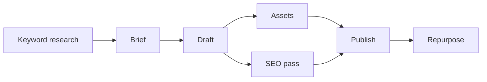
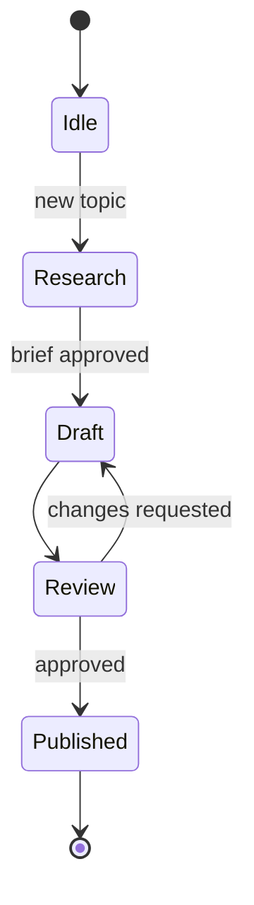

# Adrastea

A data-driven framework for building revenue from online content, with diagrams of the workflow.

---

## Content Pipeline

## Content Lifecycle

---

## The Framework

### 1. Pick a niche using demand data
- Use Google Trends, Keyword Planner, Ahrefs/Semrush, Exploding Topics to find topics with rising search volume and manageable competition.
- Look for "buyer intent" keywords (e.g., "best X for Y", "X vs Y", "how to fix X") — these monetize far better than general interest topics.
- Validate with Reddit/YouTube comment mining, Amazon reviews, and forums to see what people actually complain about or want.

### 2. Choose a monetization model up front
- Affiliate (Amazon, SaaS programs), ads (needs high volume), digital products/courses, sponsorships, subscriptions (Substack/Patreon), or lead-gen for services.
- The model determines the content: affiliate → comparison/review posts; products → problem-solving tutorials that sell your solution.

### 3. Analyze competitors
- Reverse-engineer top-ranking pages/channels: what formats, lengths, hooks, and titles work? Where are the gaps (outdated info, missing angles, poor UX)?

### 4. Produce with a repeatable system
- Batch content around topic clusters (a pillar piece + supporting pieces). Test formats across channels (blog, YouTube, Shorts/TikTok, newsletter) and repurpose.

### 5. Instrument everything
- Google Analytics 4 / Search Console, platform analytics, UTM links, and affiliate dashboards.
- Track: impressions → CTR → engagement (watch time / time-on-page) → conversion → revenue per piece.

### 6. Iterate on the data
- Double down on what converts (not just what gets views). A/B test titles/thumbnails/hooks. Update or prune underperformers. Review weekly, set monthly experiments.

### 7. Build owned audience
- Capture emails early; it's the only channel algorithms can't take from you and it lifts every other revenue stream.

---

## License

[MIT](LICENSE)
