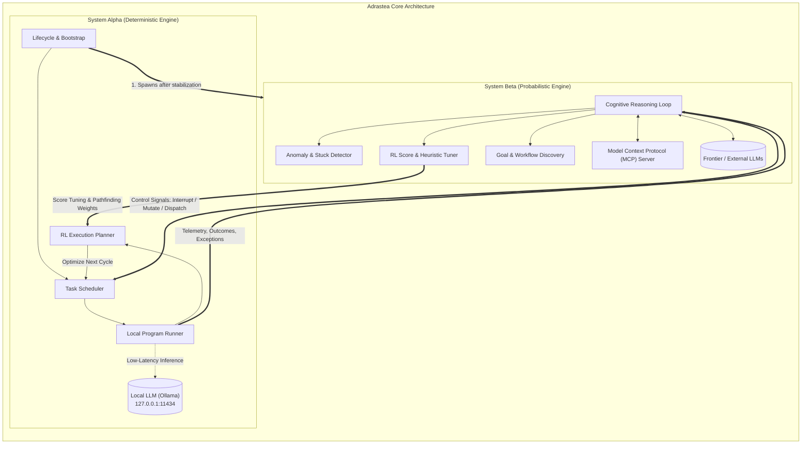
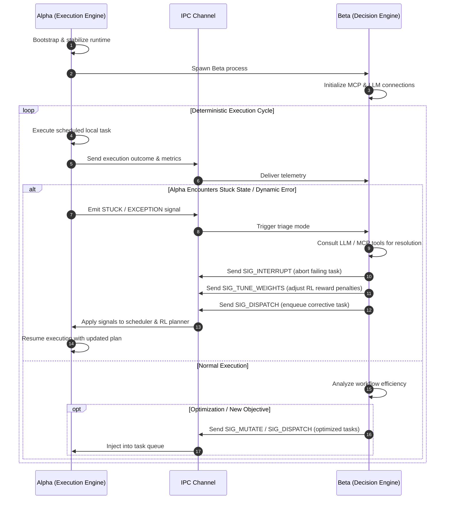

# Adrastea

**Adrastea** is a symbiotic dual-engine architecture designed for resilient, autonomous task orchestration and execution. It pairs a high-performance **deterministic execution engine (Alpha)** with a higher-order **probabilistic cognitive engine (Beta)**. 

By separating deterministic execution from non-deterministic reasoning, Adrastea achieves high throughput and reliability while retaining the flexibility to adapt to unexpected environments, solve complex anomalies, and discover new workflows.

---

## Architecture Overview

---

## Core Systems

### 1. System Alpha — Deterministic Execution Engine

System Alpha is the muscular, deterministic core of Adrastea. It operates in a continuous, reliable execution loop, managing task queues, running local programs, and adjusting its execution paths via reinforcement learning.

* **Lifecycle Management**: Initializes first. Once its environment is verified and stabilized, Alpha bootstraps and manages the process lifecycle of System Beta.
* **Task Scheduler & Local Program Runner**:
  * Schedules and dispatches local scripts, binaries, and task definitions stored within the environment.
  * Ensures reproducible execution and manages standard I/O, error logging, and process lifespans.
* **Reinforcement Learning (RL) Planner**:
  * Guides task sequences and execution workflows using scoring functions mapped to task outcomes (e.g., latency, exit codes, resource utilization, output validity).
  * Uses pathfinding heuristics to select optimal task execution branches based on historical and tuned weights.
* **Local LLM Integration**:
  * Connected natively to local inference runtimes (e.g., **Ollama** running locally on `http://127.0.0.1:11434`).
  * Used for fast, offline, low-overhead operations such as regex-free parsing, deterministic format extraction, and baseline text analysis without external API costs or cloud latency.

---

### 2. System Beta — Probabilistic Decision & Reasoning Engine

System Beta acts as the higher-level cerebral cortex of Adrastea. Operating on non-deterministic problem solving and probabilistic reasoning, Beta observes Alpha’s performance and intervenes when dynamic or unexpected conditions occur.

* **Dynamic Behavior & Anomaly Resolution**:
  * Serves as the primary decision engine whenever Alpha encounters unhandled exceptions, environment drift, or unpredictable program responses.
  * Steps in directly when Alpha enters repetitive failure states or gets stuck in execution loops.
* **RL Score Tuning (High-Level Pathfinding)**:
  * Operates like a navigational cartographer with a macro-view of Adrastea's goals.
  * Dynamically tunes the reward criteria and penalty scoring weights used by Alpha's RL planner, effectively redirecting Alpha toward more productive execution paths.
* **Adaptive Operational Loop**:
  Beta runs an autonomous loop that cycles through four primary modes:
  1. **Idle / Observe**: Passively monitors Alpha's telemetry, health metrics, and task progress.
  2. **Triage & Unstick**: Actively diagnoses and resolves blocking conditions when Alpha encounters failures.
  3. **Optimize**: Analyzes Alpha's completed execution paths to eliminate redundancies and refine workflows.
  4. **Discover & Innovate**: Hypothesizes new task sequences, generates novel objectives, and formulates alternative approaches for Alpha to execute.
* **MCP & Frontier Model Integration**:
  * Integrates with **Model Context Protocol (MCP)** servers to access external tools, services, and live context.
  * Consults frontier LLMs (via MCP or external APIs) for deep reasoning, strategic decisions, code generation, and complex troubleshooting.

---

## Inter-Process Communication (IPC) & Signaling

Alpha and Beta run as independent concurrent processes communicating via a low-latency, bidirectional IPC channel (e.g., domain sockets, named pipes, or message buses).

### Control Signals

| Signal | Origin | Purpose |
| :--- | :---: | :--- |
| `SIG_SPAWN` | Alpha $\rightarrow$ Beta | Initial process bootstrapping after Alpha achieves stable state. |
| `SIG_TELEMETRY` | Alpha $\rightarrow$ Beta | Outcome scores, exit statuses, resource metrics, and state snapshots. |
| `SIG_STUCK` | Alpha $\rightarrow$ Beta | Notification that Alpha has reached a dead-end, threshold loop, or unhandled block. |
| `SIG_INTERRUPT` | Beta $\rightarrow$ Alpha | Immediately halts an active, stuck, or invalidated local task execution. |
| `SIG_DISPATCH` | Beta $\rightarrow$ Alpha | Inserts new or modified task plans into Alpha's execution queue. |
| `SIG_MUTATE` | Beta $\rightarrow$ Alpha | Dynamically updates parameters, payloads, or configurations of in-flight tasks. |
| `SIG_TUNE_WEIGHTS` | Beta $\rightarrow$ Alpha | Updates the reward/penalty scoring matrix in Alpha's RL planner. |

---

## System Comparison

| Feature | System Alpha | System Beta |
| :--- | :--- | :--- |
| **Paradigm** | Deterministic, structured, rule-bound | Probabilistic, heuristic, non-deterministic |
| **Core Responsibility** | Task scheduling, local execution, RL planning | Anomaly resolution, RL score tuning, goal synthesis |
| **Execution Model** | Continuous scheduled loop | Multi-mode cognitive loop (Wait, Resolve, Optimize, Discover) |
| **Model Tier** | Local LLM (Ollama @ `127.0.0.1:11434`) | External / Frontier LLMs & Model Context Protocol (MCP) |
| **Role in Failure** | Detects blockages and reports symptoms | Diagnoses root cause, overrides tasks, tunes pathfinding |
| **Lifecycle** | Host process (starts first) | Guest process (spawned by Alpha post-stabilization) |

---

## Local Environment & Prerequisites

* **Local Inference**:
  * Ollama server (`ollama.exe`) listening on `http://127.0.0.1:11434`.
  * Local models for Alpha (e.g., `qwen3-coder:30b` or lightweight instruction models).
* **Tooling & Integrations**:
  * MCP (Model Context Protocol) client configuration for Beta.
  * Local execution runtime (PowerShell / Bash / Python / Node) for Alpha's task runner.
* **IPC Transport**:
  * Asynchronous cross-process message bus or socket transport supporting structured JSON / Protocol Buffer envelopes.

---

## License

[MIT](LICENSE)
